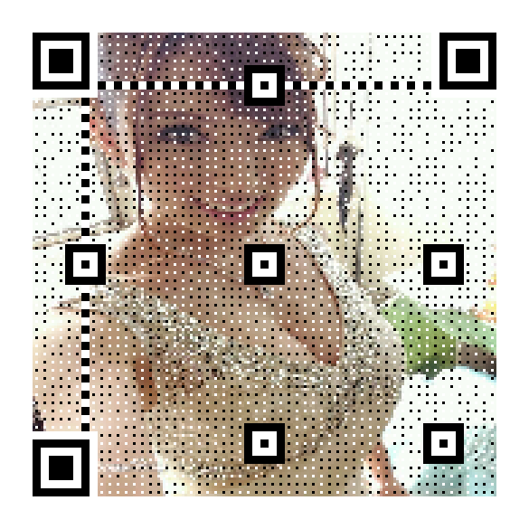

# python 玩转二维码

在移动互联网时代，一个小小的二维码已经成为身边的必需品。你去商店买东西，总是需要问有没有微信或者支付宝的二维码，否则这次购买的体验都不会好；还有，你们关注小胖哥的公众号，是怎么关注的呢，大部分也是通过扫描二维码过来的吧，还有你身边一些其他的使用，基本都是离不开二维码。

那作为一名合格的程序员，怎么能不懂二维码是如何生成，如何解析，如何玩耍的呢？废话不多说，咱们今天就用Python来玩玩这个好用的二维码。

### 演示环境
* 操作系统：windows10
* python版本：python 3.7
* 代码编辑器：pycharm 2018.2
* 使用模块：zxing,myqr,qrcode
* tips: 上面的模块都使用pip安装，它们依赖的模块也会自动安装，相信会Python的你对pip不会太陌生。
```shell
pip install qrcode
pip install myqr
pip install zxing
```

### 使用qrcode模块生成二维码

首先我们来生成一个学一门语言入门级经典语句“Hello World”。
```python
import qrcode

def first_demo():
    # 存储的字符串
    qr = qrcode.make('Hello World')
    qr.get_image().show()
```
通过上面的步骤，我们就完成了这个经典入门，拿出你的手机，用微信，QQ扫码，就会出现大大的“Hello World”字眼，有没有勾起你初学Python的回忆呢。

刚才只是小试牛刀，我们来一个进阶，把生成的二维码保存到本地。
```python
import qrcode

def second_demo():
    text = 'Python专栏'
    img = qrcode.make(text)
    # 需要传一个参数 文件名
    img.save('qr.png')
    img.show()
```


胖哥我公众号二维码大家应该很熟悉了吧，一个大大的我的形象。上面步骤生成的都是纯二维码，不符合我们的气质。接下来我要使用qrcode库生成带有内嵌图片的二维码，让你真切感受下微信二维码生成这个伟大的工程，这个二维码有很大的福利噢。

```python
from PIL import Image
import qrcode

def create_icon_qrcode():
    qr = qrcode.QRCode(
        # 二维码size尺寸大小。官方称为version
        version=1,
        # 二维码错误处理级别，有四种方式，稍后给出解释
        error_correction=qrcode.constants.ERROR_CORRECT_H,
        # 二维码图片的大小
        box_size=10,
        # 二维码白色边框的大小
        border=2
    )

    # 添加数据
    qr.add_data('小可爱你好，我是波多野结衣老湿')
    # 填充数据
    qr.make(fit=True)
    # 生成二维码图片        指定填充颜色        指定背景颜色
    img = qr.make_image(fill_color='grey',back_color='white')

    # 得到生成的二维码图片的宽，高
    img_w,img_h = img.size

    # 添加图片到二维码中
    # 使用pillow的Image打开图片
    icon = Image.open('girl.jpg')
    
    # 设置icon的大小,为二维码图片大小的6分之一
    factor = 3
    size_w = img_w // factor
    size_h = img_h // factor

    # 得到icon图片的大小
    icon_w,icon_h = icon.size

    # 只有当我们icon图片的大小超过了二维码图片的3分之一的时候，才对icon图片大小重新定义大小。
    if icon_w > size_w:
        icon_w = size_w
    if icon_h > size_h:
        icon_h = size_h

    # 重新设置icon的尺寸
    icon = icon.resize((icon_w,icon_h),Image.ANTIALIAS)
    # 得到在二维码中显示的位置，坐标。
    w =  (img_w - icon_w) // 2
    h =  (img_h - icon_h) // 2

    img.paste(icon,(w,h),mask=None)
    img.save('girl.png')
```
**这里说一下version参数和error_correction参数：**
 1. version: 就是二维码图片的size，官方称作为version。version为1的时候，二维码就是21*21组成的正方形，version为2的话就是25*25，version为3的话就是29*29。最大为40。所以说最大的尺寸为(40 - 1) * 4 + 21 = 177. 也就是177*177 正方形。
 2. error_correction: 纠错级别，级别越高，纠错能力越强。这也就是为什么我们的二维码残缺了一点点，也能够正确的读取到信息的原因。
 
 **错误修正容量**

|||
|:------:|:------:|
|L水平|7%的字码可被修正|
|M水平|15%的字码可被修正|
|Q水平|25%的字码可被修正|
|H水平|30%的字码可被修正|

通过上面的步骤，就生成了一张灰色背景填充的二维码，最最核心的中间部分，是我们敬爱的波多野结衣老湿。


**github地址：** `https://github.com/lincolnloop/python-qrcode`

上面就是qrcode库的基本使用。接下来我们再介绍一下MyQr库。这个库就相当强大，强大到可以使用图片作为二维码的背景，甚至是动态图。


### 使用MyQr模块生成二维码

```python
import os
from MyQR import myqr

def myqr_demo():
    # 注意，这里的字符串不能出现中文，只能以下这些
    # supported_chars = r"0123456789ABCDEFGHIJKLMNOPQRSTUVWXYZabcdefghijklmnopqrstuvwxyz ··,.:;+-*/\~!@#$%^&`'=<>[]()?_{}|"
    words = 'hello world'
    # 调用myqr.run方法，就能够生成图片了。返回三个值，二维码的version，纠错级别，二维码的完整路径
    version, level, qr_name = myqr.run(
        # 存放的数据
        words=words,
        # 二维码size
        version=10,
        # 选取的背景图片
        picture='girl.jpg',
        # 是否为彩色。如果为False，那么就是黑白的
        colorized=True,
        # 保存到本地的名字
        save_name='girl_img.png',
        # 保存二维码的目录,这里就是当前目录。默认就是这个
        save_dir=os.getcwd()
    )
    print(version,level,qr_name)
```

执行以上代码，我们就可以生成一张以我们的图片作为背景的二维码。


如果我们需要将动态图作为背景图，其实也和正常的背景图类似，只需要写入背景图的文件名就行了，然后保存图片的时候，将二维码的后缀名改成gif即可.

**github地址:** `https://github.com/sylnsfar/qrcode`

**这里简单的比较一下这两个库吧**
1. qrcode支持中文数据，而myqr不支持中文等字符。
2. qrcode不能设置背景图，但是能将图片放在二维码中间。
3. myqr可以将背景设置为图片，并且允许为动态图。

### 使用zxing库解析二维码
	
上面我们只说了如何生成二维码图片。接下来我还是介绍下如何解析二维码中的信息。

```python
import zxing

def parse_qrcode(filename):
    reader = zxing.BarCodeReader()
    barcode = reader.decode(filename)
    print(barcode.parsed)
```

短短的几行代码，就能解析出复杂而又简单的二维码，并且得到里面的详细数据。

**注意：**
如果二维码中的数据包含中文，那么应该会报这样的错误。`UnicodeDecodeError: 'utf-8' codec can't decode byte 0xc0 in position 0: invalid start byte`
这个时候我们只需要找到具体错误的代码位置，修改一下这个库的源码就行了。

修改位置在zxing包下面的__init__.py文件中第81行代码处。

原来是这样的
```python
raw = raw[:-1].decode()
parsed = parsed[:-1].decode()
return cls(format, type, raw, parsed, points)
```

我们需要修改为下面这样
```python
raw = raw[:-1].decode(encoding='gbk')
parsed = parsed[:-1].decode(encoding='gbk')
return cls(format, type, raw, parsed, points)
```

这样就不会出错了。

这样，我们就成功的对二维码进行解析了。
