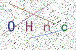

# python 生成验证码

验证码是我们web开发中不可缺少的元素。所以作为一个web开发人员，验证码的制作肯定也是不能落下的。今天我们就来使用python制作一个验证码。


### 演示环境
* 操作系统：windows10
* python版本：python 3.7
* 代码编辑器：pycharm 2018.2
* 使用第三方模块：pillow

### 验证码的必须元素
1. 一张图片
2. 文本
3. 干扰元素
    * 线条干扰
    * 小圆点干扰

### 熟悉pillow库

我们既然需要使用pillow库制作验证码，那么首先我们先来熟悉一下我们需要用到的方法。

1. Image.new(): 这个方法可以生成一张图片，有三个参数。
    * mode:颜色空间模式，可以是`'RGBA','RGB','L'`等等模式
    * size:图片尺寸，接收一个两个整数的元祖
    * color:图片的填充颜色，可以是`red，green`等，也可以是rgb的三个整数的元祖。也就是背景颜色
    
```python
from PIL import Image

captcha = Image.new('RGB', (1080, 900), (255,255,255))
```

上面代码创建了一个亿RGB为颜色空间模式，尺寸为1080*900，背景颜色为白色的图片。

2. Image.save(): 保存图片到本地
    * fp: 本地文件名
    * format: 可选参数，制定文件后缀名。
    
```python
from PIL import Image

captcha = Image.new('RGB', (1080, 900), (255,255,255))

# captcha.save('captcha.png')
captcha.save('captcha', format='png')
```
上面两种方式保存效果是一样的。

3. Image.show():显示图片，会调用电脑自带的显示图片的软件。

4. ImageFont.truetype(): 加载一个字体文件。生成一个字体对象。
```python
from PIL import ImageFont
#                        字体文件路径 字体大小
font = ImageFont.truetype('simkai.ttf', 16)
```

5. ImageDraw.Draw(): 生成画笔对象。
```python
from PIL import Image, ImageDraw

captcha = Image.new('RGB', (1080, 900), 'red')
draw = ImageDraw.Draw(captcha)
```
上面就创建了一个在captcha这张图片上的画笔，我们在这个图片上画任何东西都会使用这个画笔对象。

6. ImageDraw.Draw().text():在图片上绘制给定的字符
```python
from PIL import Image, ImageDraw, ImageFont

captcha = Image.new('RGB', (1080, 900), 'red')
font = ImageFont.truetype('simkai.ttf', 16)
draw = ImageDraw.Draw(captcha)

#      字符绘制位置  绘制的字符    制定字体      字符颜色
draw.text((0,0), 'hello world', font=font, fill='black')
```

7. ImageDraw.Draw().line():在图片上绘制线条
```python
from PIL import Image, ImageDraw, ImageFont

captcha = Image.new('RGB', (1080, 900), 'red')
draw = ImageDraw.Draw(captcha)

#         线条起点  线条终点
draw.line([(0,0),(1080,900)], fill='black')
```

8. ImageDraw.Draw().point(): 在图片上绘制点
```python
from PIL import Image, ImageDraw, ImageFont

captcha = Image.new('RGB', (1080, 900), 'red')
font = ImageFont.truetype('simkai.ttf', 16)
draw = ImageDraw.Draw(captcha)

#           点的位置      颜色
draw.point((500,500), fill='black')
```

制作我们的验证码我们就会使用到上面的方法。当然，pillow肯定不止这些方法，这里我们就只列举这些了。

### 制作验证码

1. 首先我们定义一个类，初始化一些需要的参数。
```python

import string

class Captcha():
    '''
    captcha_size: 验证码图片尺寸
    font_size: 字体大小
    text_number: 验证码中字符个数
    line_number: 线条个数
    background_color: 验证码的背景颜色
    sources: 取样字符集。验证码中的字符就是随机从这个里面选取的
    save_format: 验证码保存格式
    '''
    def __init__(self, captcha_size=(150,100), font_size=30,text_number=4, line_number=4, background_color=(255, 255, 255), sources=None, save_format='png'):
        self.text_number = text_number
        self.line_number = line_number
        self.captcha_size = captcha_size
        self.background_color = background_color
        self.font_size = font_size
        self.format = save_format
        if sources:
            self.sources = sources
        else:
            self.sources = string.ascii_letters + string.digits
```

这里说一下string模块。
* string.ascii_letters: 得到a-zA-Z所有字符
* string.digits: 得到0-9所有数字

2. 随机从sources获取字符
```python
import random

def get_text(self):
    text = random.sample(self.sources,k=self.text_number)
    return ''.join(text)
```

random.sample()方法：从第一个参数中随机获取字符。获取个数有第二个参数指定。

3. 随机获取绘制字符的颜色
```python

def get_font_color(self):
    font_color = (random.randint(0, 150), random.randint(0, 150), random.randint(0, 150))
    return font_color
```

4. 随机获取干扰线条的颜色
```python
def get_line_color(self):
    line_color = (random.randint(0, 250), random.randint(0, 255), random.randint(0, 250))
    return line_color
```

5. 编写绘制文字的方法
```python
def draw_text(self,draw, text, font, captcha_width, captcha_height, spacing=20):
    '''
    在图片上绘制传入的字符
    :param draw: 画笔对象
    :param text: 绘制的所有字符
    :param font: 字体对象
    :param captcha_width: 验证码的宽度 
    :param captcha_height: 验证码的高度
    :param spacing: 每个字符的间隙
    :return: 
    '''
    # 得到这一窜字符的高度和宽度
    text_width, text_height = font.getsize(text)
    # 得到每个字体的大概宽度
    every_value_width = int(text_width / 4)

    # 这一窜字符的总长度
    text_length = len(text)
    # 每两个字符之间拥有间隙，获取总的间隙
    total_spacing = (text_length-1) * spacing

    if total_spacing + text_width >= captcha_width:
        raise ValueError("字体加中间空隙超过图片宽度!")
    
    # 获取第一个字符绘制位置
    start_width = int( (captcha_width - text_width - total_spacing) / 2 )
    start_height = int( (captcha_height - text_height) / 2 )

    # 依次绘制每个字符
    for value in text:
        position = start_width, start_height
        print(position)
        # 绘制text
        draw.text(position, value, font=font, fill=self.get_font_color())
        # 改变下一个字符的开始绘制位置
        start_width = start_width + every_value_width + spacing
```

6. 绘制线条的方法
```python
def draw_line(self, draw, captcha_width, captcha_height):
    '''
    绘制线条
    :param draw: 画笔对象 
    :param captcha_width: 验证码的宽度 
    :param captcha_height: 验证码的高度
    :return: 
    '''
    # 随机获取开始位置的坐标
    begin = (random.randint(0,captcha_width/2), random.randint(0, captcha_height))
    # 随机获取结束位置的坐标
    end = (random.randint(captcha_width/2,captcha_width), random.randint(0, captcha_height))
    draw.line([begin, end], fill=self.get_line_color())
```

7. 绘制小圆点
```python
def draw_point(self, draw, point_chance, width, height):
    '''
    绘制小圆点
    :param draw: 画笔对象
    :param point_chance: 绘制小圆点的几率 概率为 point_chance/100
    :param width: 验证码宽度
    :param height: 验证码高度
    :return:
    '''
    # 按照概率随机绘制小圆点
    for w in range(width):
        for h in range(height):
            tmp = random.randint(0, 100)
            if tmp < point_chance:
                draw.point((w, h), fill=self.get_line_color())
```

8. 制作验证码
```python
def make_captcha(self):
    # 获取验证码的宽度， 高度
    width, height = self.captcha_size
    # 生成一张图片
    captcha = Image.new('RGB',self.captcha_size,self.background_color)
    # 获取字体对象
    font = ImageFont.truetype('simkai.ttf',self.font_size)
    # 获取画笔对象
    draw = ImageDraw.Draw(captcha)
    # 得到绘制的字符
    text = self.get_text(

    # 绘制字符
    self.draw_text(draw, text, font, width, height)

    # 绘制线条
    for i in range(self.line_number):
        self.draw_line(draw, width, height)

    # 绘制小圆点 10是概率 10/100， 10%的概率
    self.draw_point(draw,10,width,height)

    # 保存图片
    captcha.save('captcha',format=self.format)
    # 显示图片
    captcha.show()
```

这样，我们就生成了我们的图片验证码了，效果图.

