# 破解点评网的字体反爬

不得不说，点评网的反爬做的是真厉害。各个方面的反爬都有涉及，这里我们主要来看一下字体反爬这个玩意儿。

### 演示环境
* 操作系统：windows10
* python版本：python 3.7
* 代码编辑器：pycharm 2018.2
* 使用模块：requests,json,re,fontTools

### 什么是字体反爬？
首选我们先来看一下点评网的评论信息。

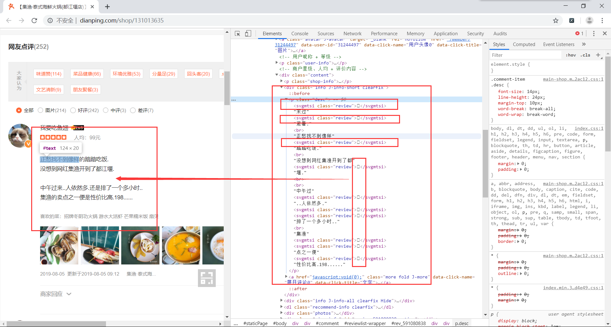

从这里我们可以看到，网页上显示的文字和源码中显示的文字有些出入，并不是一一对应，那我们继续查看sources中的代码。

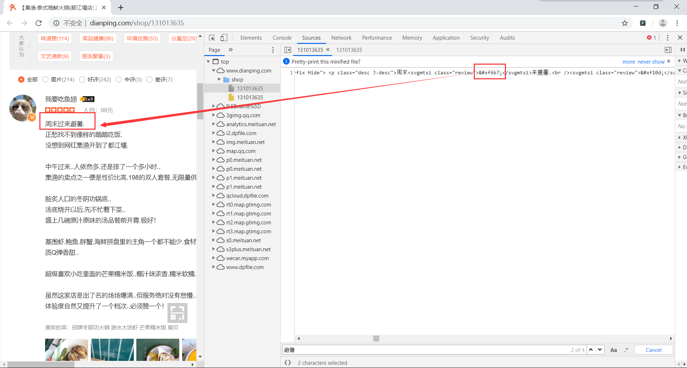

我们可以看到，评论中的某些文字点评网做了特殊处理，这就是所谓的字体反爬。

### 抓取数据

前面的步骤，我们已经知道点评网对评论内容做了处理，至于是如何处理，这里我们先不管，还是先把数据拿到再说。要是数据都没有拿到，还怎么对数据进行处理呢？是吧。

首先我们使用谷歌的network模块，对所有请求进行抓包。然后我们随便搜索一个评论中的某些东西，找到返回的评论数据请求。这里我使用评论人的名字进行搜索，找到其中的请求。有没有觉得这个请求就是返回的评论数据呢。让我们来验证下。因为这里返回的是一个json数据，我们借助在线json数据查看工具，方便我们对内容进行查看。

这里我们将复制下来，然后在浏览器中输入网址```json.cn```
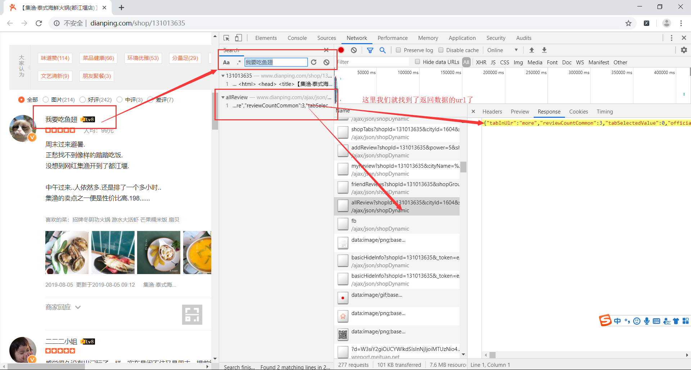

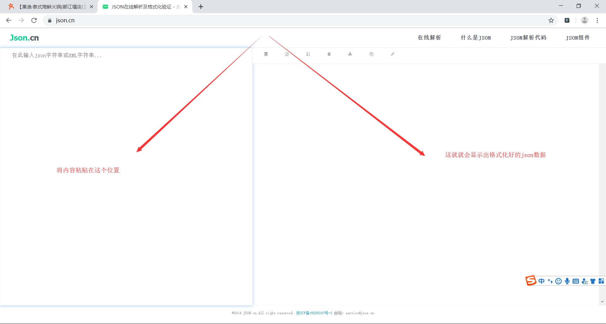

紧接着我们就能看到解析出来的json数据。
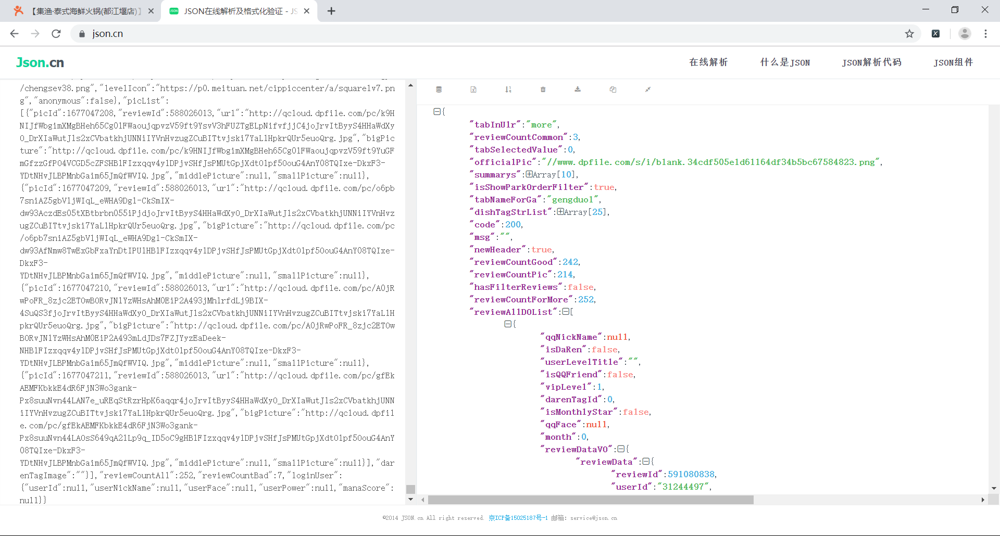

经过分析，我们知道所有的评论数据都在`['reviewAllDOList']`，这个集合里装了当前页面前10人的评论数据。这样我们就可以通过列表遍历的方式拿到相应的数据。

我们通过点击这个url的headers,找到请求的url，准备获取数据。

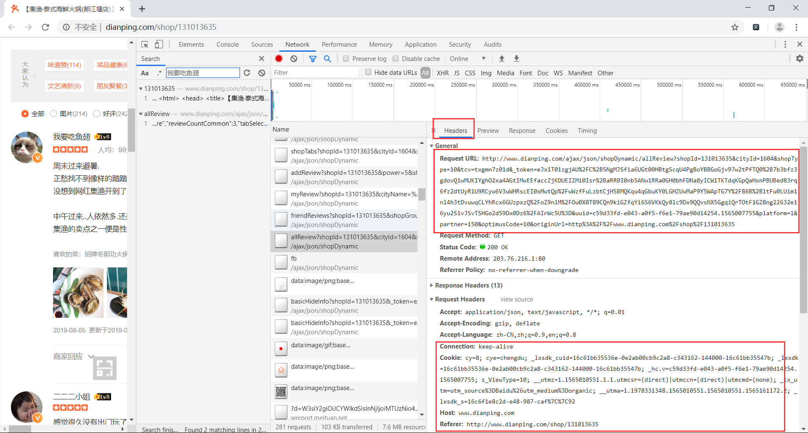

**注意：**
* 这个获取到的url只能使用一会儿，过一会就会变化。如果我们一直使用这个url请求，后面就会得不到数据。所以后续当我们请求不到数据的时候，就需要刷新网页，获取一个新的url。因为url中有个_token参数是每次变化的。
* 然后下面框中的内容，我们也必须在请求头中添加上去，否则也还是得不到数据。
* 我们这里的重点是在字体反爬，所以其他的一些反爬在这里就不进行赘述了。

至此我们就找到请求的评论接口数据，直接请求这个url，就能得到我们想要的数据。
```python
import requests
import json
import re

def get_page_info():
    # 首先分析网页，找到返回评论数据的url，这个url就会直接返回评论数据了，但是urlt中的token是会变化的，只能用一会儿，我也不知道一会儿是好久,得不到数据了就换url吧
    url = 'http://www.dianping.com/ajax/json/shopDynamic/allReview?shopId=131013635&cityId=1604&shopType=10&tcv=7bbq1hdmsj&_token=eJxVTstugkAU%2FZe7nsBcBlBIulBrGxC0MmATTReACoSCFIg4Nv33Thu66Oq8k%2FMJrXMEGymlOhK4nlqwARWqmECg72RimAZOkFkTauoE0v%2BehRqBpN09gn1glkEmhv72YwRSH9BgJpma0hmpJqmmE%2B2348gK5H3f2Ko6DINyLOK6KepMSS%2BV2uWXRkWGFJnJDHkF5KQK5URiOWI8Yv%2BnfflddrsiqyU7ubeQd3r3cQ78Loyof58HQlgrzjXhpejxiHn3Zb%2BO%2BHUjFtOZCMrkOc%2Fi6lYlWbZbrLKeJ1u6RqfxUuaHhWitZb0Oy4RHrnveV0X6%2FhQ0VbPZvu5FOZ%2B91Oi4wwN8fQMlVWIi&uuid=c59d33fd-e043-a0f5-f6e1-79ae90d14254.1565007755&platform=1&partner=150&optimusCode=10&originUrl=http%3A%2F%2Fwww.dianping.com%2Fshop%2F131013635'

    # 定义模拟请求头
    headers = {
        'User-Agent':'Mozilla/5.0 (Windows NT 10.0; Win64; x64) AppleWebKit/537.36 (KHTML, like Gecko) Chrome/75.0.3770.142 Safari/537.36',
        'Cookie': 'cy=8; cye=chengdu; _lxsdk_cuid=16c61bb35536e-0e2ab00cb9c2a8-c343162-144000-16c61bb35547b; _lxsdk=16c61bb35536e-0e2ab00cb9c2a8-c343162-144000-16c61bb35547b; _hc.v=c59d33fd-e043-a0f5-f6e1-79ae90d14254.1565007755; s_ViewType=10; __utmz=1.1565010551.1.1.utmcsr=(direct)|utmccn=(direct)|utmcmd=(none); _lx_utm=utm_source%3DBaidu%26utm_medium%3Dorganic; __utma=1.1978331348.1565010551.1565010551.1565161172.2; __utmc=1; _lxsdk_s=16c6b1cf413-8ae-d6-7b8%7C%7C31',
        'Referer':'http://www.dianping.com/shop/131013635',
        'Connection': 'keep-alive',
    }

    # 使用requests库请求url，得到数据json数据
    result_json_str = requests.get(url,headers=headers).text
    # 应为返回的数据是里面包含富文本数据，所以首先使用正则表达式删除标签
    result_json_str = re.sub('<.*?>','',result_json_str)
    
    # json数据其实就是一个字符串，所以我们需要先将json转化为python能操作的字典
    result = json.loads(result_json_str)
    # 分析得到的数据，得到我们需要的所有评论在result['reviewAllDOList']里面
    all_review = result['reviewAllDOList']

    # 遍历得到的所有评论
    for review in all_review:
        # 得到用户名
        username = review['user']['userNickName']
        # 得到评论内容
        content = review['reviewDataVO']['reviewBody']
        # 这里我们就是简单的显示出内容就是了，没有进行储存
        print('*'*30,'\n',username,content,'\n','*'*30)
```

运行代码，查看数据，得到的数据果然就是经过处理的。

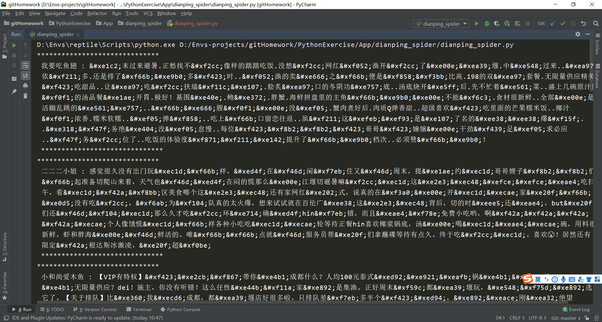

### 破解字体反爬

上面我们虽然拿到了数据，但是这些都是经过处理之后的数据，拿着完全不能用，所以还是得想办法将他给破解下。

首先我们分析网页得知，这些处理之后的数据class都为review，然后他的字体都是`'PingFangSC-Regular-review'`

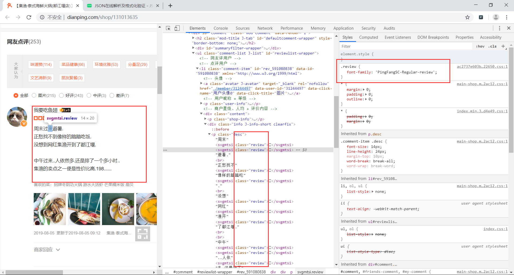

我们猜想这就是点评网自己定义的字体。居然自定义了字体，那么网页中肯定需要加载字体文件，所以我们果断打开network对字体文件进行抓包。

搜索关键字`'PingFangSC-Regular-review'`，然后就能找到相应的信息。

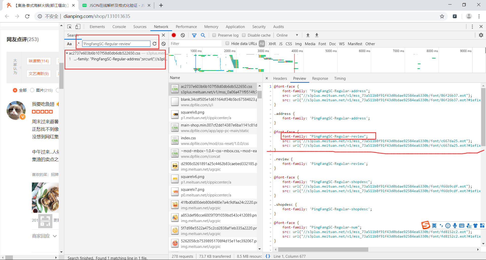

我们可以看到，点评网有许多个自定义的字体，这里我们只需要找自己想要的字体文件即可，即找字体文件的url。只是这些字体文件一般都是.woff或者.ttf结尾的，所以我们将下面的滚动条往右边拖动，我们就能找到一个.woff的url了。

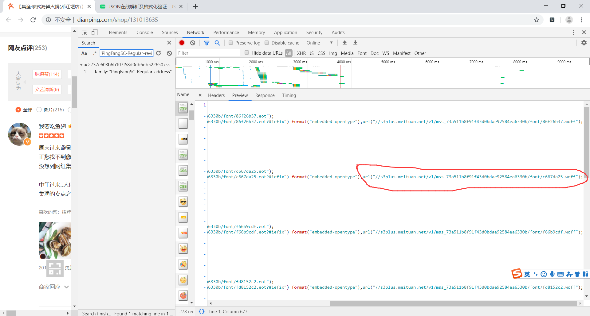

发现这个url前面是以`//`开始的，所以我们直接在网址前面加https就行了，那么完整的url就是`https://s3plus.meituan.net/v1/mss_73a511b8f91f43d0bdae92584ea6330b/font/c667da25.woff`

然后，我们在浏览器中输入这个网址，就会给我们下载一个后缀是.woff的字体文件。

为了我们方便查看字体文件的内容，我们还需要下载fontCreator这个软件。使用这个软件打开我们刚才下载的文件，就能够看到相应的值。fontCreator官网地址为```https://www.high-logic.com/font-editor/fontcreator```

使用fontCreator打开这个woff文件，如下图所示。

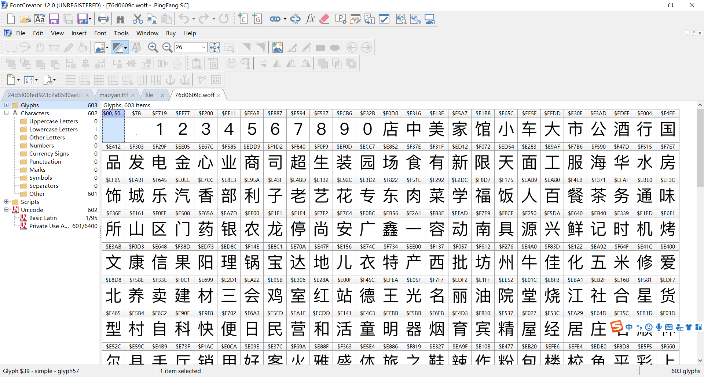

我们得把这里面所有的文字按顺序都写出来，并用一个列表保存，空的数据使用''表示。是的，你没有看错，将这些文字全部写下。这些就是字体的形状，我们已经认识了这些字，但我们还得让程序也认识这些字，当然你也可以使用机器学习来识别这些文字，注意：一定要按顺序来，不能遗漏，不然的话对应关系会出错，替换出来的结果也就会出错。

我们把文字敲出来之后，然后我们需要得到字体形状对应的名字，对应代码字符串。这里我们需要使用`fontTools`这个第三方库来帮助我们处理字体文件。

```python
from fontTools.ttLib import TTFont

def get_font_map():
    # 这个字体文件需要先析网页，找到这个url，然后下载下来到本地，然后使用TTFont()加载字体文件 
    #       字体文件的名字
    font = TTFont('76d0609c.woff')
    # 得到cmap 字体对应代码->字体名字
    font_cmap = font.getBestCmap()
    # 得到所有的字体名字
    font_names = font.getGlyphOrder()
    # 这个文字是先使用fontCreator软件打开字体文件，然后查看到字体，从而得到的数据
    texts = [
        '','','1','2','3','4','5','6','7','8',
        '9','0','店','中','美','家','馆','小','车','大',
        '市','公','酒','行','国','品','发','电','金','心',
        '业','商','司','超','生','装','园','场','食','有',
        '新','限','天','面','工','服','海','华','水','房',
        '饰','城','乐','汽','香','部','利','子','老','艺',
        '花','专','东','肉','菜','学','福','饭','人','百',
        '餐','茶','务','通','味','所','山','区','门','药',
        '银','农','龙','停','尚','安','广','鑫','一','容',
        '动','南','具','源','兴','鲜','记','时','机','烤',
        '文','康','信','果','阳','理','锅','宝','达','地',
        '儿','衣','特','产','西','批','坊','州','牛','佳',
        '化','五','米','修','爱','北','养','卖','建','材',
        '三','会','鸡','室','红','站','德','王','光','名',
        '丽','油','院','堂','烧','江','社','合','星','货',
        '型','村','自','科','快','便','日','民','营','和',
        '活','童','明','器','烟','育','宾','精','屋','经',
        '居','庄','石','顺','林','尔','县','手','厅','销',
        '用','好','客','火','雅','盛','体','旅','之','鞋',
        '辣','作','粉','包','楼','校','鱼','平','彩','上',
        '吧','保','永','万','物','教','吃','设','医','正',
        '造','丰','健','点','汤','网','庆','技','斯','洗',
        '料','配','汇','木','缘','加','麻','联','卫','川',
        '泰','色','世','方','寓','风','幼','羊','烫','来',
        '高','厂','兰','阿','贝','皮','全','女','拉','成',
        '云','维','贸','道','术','运','都','口','博','河',
        '瑞','宏','京','际','路','祥','青','镇','厨','培',
        '力','惠','连','马','鸿','钢','训','影','甲','助',
        '窗','布','富','牌','头','四','多','妆','吉','苑',
        '沙','恒','隆','春','干','饼','氏','里','二','管',
        '诚','制','售','嘉','长','轩','杂','副','清','计',
        '黄','讯','太','鸭','号','街','交','与','叉','附',
        '近','层','旁','对','巷','栋','环','省','桥','湖',
        '段','乡','厦','府','铺','内','侧','元','购','前',
        '幢','滨','处','向','座','下','県','凤','港','开',
        '关','景','泉','塘','放','昌','线','湾','政','步',
        '宁','解','白','田','町','溪','十','八','古','双',
        '胜','本','单','同','九','迎','第','台','玉','锦',
        '底','后','七','斜','期','武','岭','松','角','纪',
        '朝','峰','六','振','珠','局','岗','洲','横','边',
        '济','井','办','汉','代','临','弄','团','外','塔',
        '杨','铁','浦','字','年','岛','陵','原','梅','进',
        '荣','友','虹','央','桂','沿','事','津','凯','莲',
        '丁','秀','柳','集','紫','旗','张','谷','的','是',
        '不','了','很','还','个','也','这','我','就','在',
        '以','可','到','错','没','去','过','感','次','要',
        '比','觉','看','得','说','常','真','们','但','最',
        '喜','哈','么','别','位','能','较','境','非','为',
        '欢','然','他','挺','着','价','那','意','种','想',
        '出','员','两','推','做','排','实','分','间','甜',
        '度','起','满','给','热','完','格','荐','喝','等',
        '其','再','几','只','现','朋','候','样','直','而',
        '买','于','般','豆','量','选','奶','打','每','评',
        '少','算','又','因','情','找','些','份','置','适',
        '什','蛋','师','气','你','姐','棒','试','总','定',
        '啊','足','级','整','带','虾','如','态','且','尝',
        '主','话','强','当','更','板','知','己','无','酸',
        '让','入','啦','式','笑','赞','片','酱','差','像',
        '提','队','走','嫩','才','刚','午','接','重','串',
        '回','晚','微','周','值','费','性','桌','拍','跟',
        '块','调','糕'
    ]

    font_name_map = {}

    # 将 字体名字 和 我们查看到的值 组成一个字典 
    for index,value in enumerate(texts):
        font_name_map[font_names[index]] = value

    return font_cmap,font_name_map
```

这里我还是很贴心的给大家画了一个图来解释其中的对应关系。

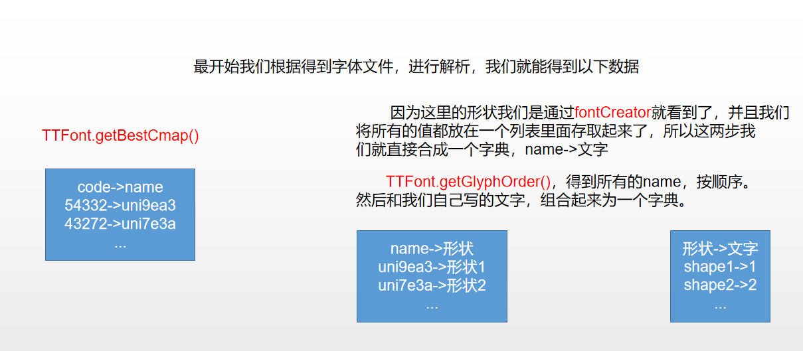

这样，我们就得到了字体的对应关系，但是我们的code是一个整数，而网页上显示的是`&#xef05;&#xe40e;`类似这样的数据，这个就是将我们的code变成16进制，然后将最前面的`0`替换为`&#`，然后在最后面添加一个`;`。所以，我们也将我们的code按照这个规则进行转换，然后使用re模块。只要找到这样的一个code，就直接替换为我们的文字。这样，我们就能够拿到准确的数据了。

所以，我们最后的`get_page()`函数的代码如下所示
```python
def get_page(font_names_map=None,font_cmap=None):
    # 首先分析网页，找到返回评论数据的url，这个url就会直接返回评论数据了，但是urlt中的token是会变化的，只能用一会儿，我也不知道一会儿是好久,得不到数据了就换url吧
    url = 'http://www.dianping.com/ajax/json/shopDynamic/allReview?shopId=131013635&cityId=1604&shopType=10&tcv=txgmn7z01d&_token=eJxVj81ugkAUhd9ltp3A%2FCskXag1DQq2MmBSTReAOhIEEYg6Nn33Do1ddHXO%2Fe45yb1foPG2wMUIIYYhuOwa4AJsIUsACLrWbLjgRGBHcIdzCLJ%2FTPABhSBtVi%2FA3TCC4ICzzx6EZt5gTgUcCkMelhhLGCS%2FGc9EwKHrate2r9ertc2Tqs4rZWWn0m4Pp9rGFCNMBeXmFGAqZdRXCKOQDFgPih4YTR7a%2Fc2BecKU2lxVxu1mt0i2rD3vw6CNYhTcx6HWzlxKov0M%2BzKm%2Fn3aLWJ5edOT4UiHRfp6UEl5K1OlVpO56mS6RAvs1X5GgyjXjTOtFlGRyng226%2BPR1nwp2S9uhUfda7Go3d99jz0DL5%2FANI8Y5M%3D&uuid=c59d33fd-e043-a0f5-f6e1-79ae90d14254.1565007755&platform=1&partner=150&optimusCode=10&originUrl=http%3A%2F%2Fwww.dianping.com%2Fshop%2F131013635'

    # 定义模拟请求头,注意，得不到数据的时候，也要将Cookie的值进行替换
    headers = {
        'User-Agent':'Mozilla/5.0 (Windows NT 10.0; Win64; x64) AppleWebKit/537.36 (KHTML, like Gecko) Chrome/75.0.3770.142 Safari/537.36',
        'Cookie': 'cy=8; cye=chengdu; _lxsdk_cuid=16c61bb35536e-0e2ab00cb9c2a8-c343162-144000-16c61bb35547b; _lxsdk=16c61bb35536e-0e2ab00cb9c2a8-c343162-144000-16c61bb35547b; _hc.v=c59d33fd-e043-a0f5-f6e1-79ae90d14254.1565007755; s_ViewType=10; __utmz=1.1565010551.1.1.utmcsr=(direct)|utmccn=(direct)|utmcmd=(none); _lx_utm=utm_source%3DBaidu%26utm_medium%3Dorganic; __utma=1.1978331348.1565010551.1565010551.1565161172.2; _lxsdk_s=16c70ded480-ab0-fe2-71%7C%7C2',
        'Referer':'http://www.dianping.com/shop/131013635',
        'Connection': 'keep-alive',
    }

    # 使用requests库请求url，得到数据json数据
    result_json_str = requests.get(url,headers=headers).text
    # 应为返回的数据是富文本数据，所以首先我们先去掉标签
    result_json_str = re.sub('<.*?>','',result_json_str)

    # 遍历 字体代码->字体名字 这个字典（code 是一个数字）
    for code, name in font_cmap.items():
        try:
            # 尝试从 字体名字 -> 对应值 这个字典中得到值，防止程序出现KeyError的错误
            text = font_names_map[name]
        except:
            pass
        else:
            # 分析网页信息得知，将code变成16进制，并且把最前面的0换成&#，在加上一个';'. 就是网页加密了的字符窜了
            # 这里就是将59322这样的值变成类似`&#xef05;&#xe40e;`的值
            code_str = str(hex(code)).replace('0', '&#', 1) + ';'
            print(code, code_str, name, text)
            # 将得到的加密之后的字符串进行替换为相应的数据
            # result_str = re.sub('需要替换的字符窜','替换为怎样的字符串','从这个字符串里面查找')
            result_json_str = re.sub(code_str, text, result_json_str)

    # 处理之后的数据使用json模块变成字典
    result = json.loads(result_json_str)
    # 分析得到的数据，得到我们需要的所有评论在result['reviewAllDOList']里面
    # 因为这里有可能我们别识别出来是一个爬虫了，就会返回其他的数据，比如说你没有登陆啊这样的提示。所以这个时候我们就需要改变我们的额url了。然后重新运行我们的爬虫了
    try:
        all_review = result['reviewAllDOList']
    except:
        print(result_json_str)
        raise ValueError('爬取数据失败')

    # 遍历得到的所有评论
    for review in all_review:
        # 得到用户名
        username = review['user']['userNickName']
        # 得到评论内容
        content = review['reviewDataVO']['reviewBody']
        # 因为我们的重点是字体反爬，所以这里我们就是简单的显示出内容就是了
        print('*'*30,'\n',username,":",content,'\n','*'*30)
```

呼。。。我们终于破解了点评网的字体加密。

最后还有一点需要注意，因为这个程序我当天写好之后，能成功的替换相应的字符串，但是当我第二天运行程序的时候，缺不能替换了。经过分析发现，原来是点评网每天（或许不是每天，每几个小时）应该都会变换字体文件，然后`code->name，name->形状`也就对应不上了，但是`形状->值`一定是对应上的，这个不会变化。那么我们每次运行之前，就直接找到字体文件对应的url，然后先将这个文件下载保存到本地，再运行我们的爬虫即可。注意，这个字体文件的url是会变化的，也就是点评网的服务器上每个字体应该存放了好几个不同的字体文件。所以我们每次运行都需要先去找到对应的字体文件的url。

```python
from urllib.request import urlretrieve

def get_font_file():
    url = 'https://s3plus.meituan.net/v1/mss_73a511b8f91f43d0bdae92584ea6330b/font/c667da25.woff'
    urlretrieve(url,'font.woff')
```

这里说一下`urlretrieve`函数的用法吧。

`urlretrieve`：将网络上的文件下载下来，保存到本地。第一个参数为url，第二个参数为保存到本地文件的文件名。

使用这个函数我们可以很方便的下载网络上一些文件，图片等。

最后我们来看一波运行结果吧。
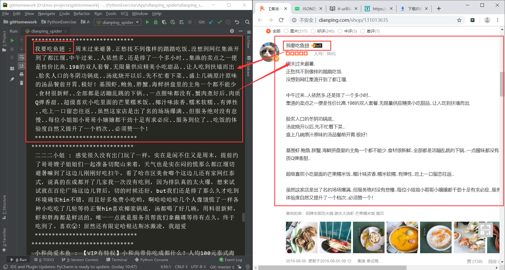

不得不服点评网，反爬虫做的真是厉害。。。
