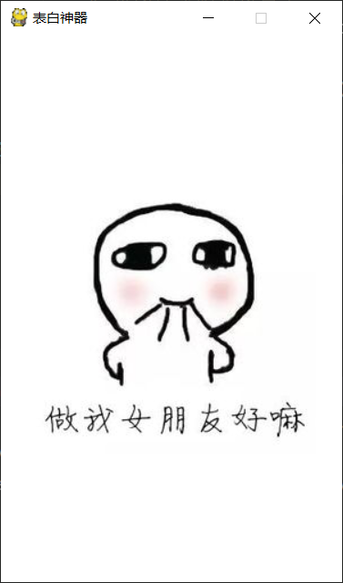
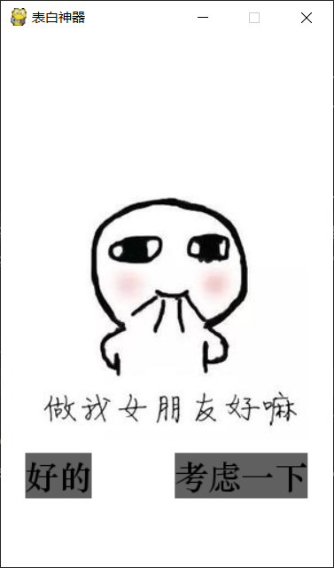
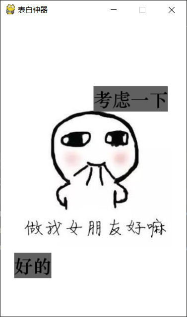
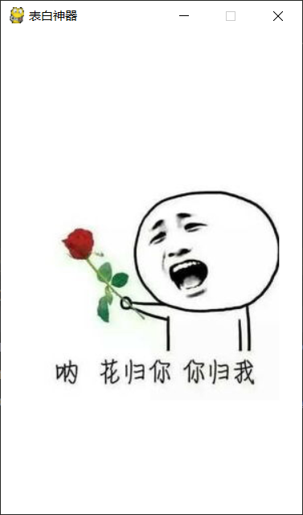

# python实现抖音表白神器

国庆节快要到了，7天大长假大家准备去哪里玩呢？宅在家里打游戏？还是和女朋友出去浪啊？

什么，你说你没有女朋友？

当时我就不乐意了，马上用python写了一个抖音表白神器，快拿去表白吧。

### 演示环境
* 操作系统：windows10
* python版本：python 3.7
* 代码编辑器：pycharm 2018.2
* 使用模块：pygame, random
* tips: pygame需要单独安装，pip install 一下就好了

### 具体实现

1. 首先我们得放一张可爱的图片上去是吧.
```python
import pygame

def main():
    # 初始化pygame
    pygame.init()

    # 规定窗口的大小
    size = 300, 480
    # 得到一这个窗口
    screen = pygame.display.set_mode(size)
    # 设置窗口的标题
    pygame.display.set_caption('表白神器')

    # 加载图片
    image = pygame.image.load('./images/biaobai.png').convert_alpha()
    # 得到图片的尺寸
    image_size = image.get_size()

    # 计算图片的放置位置， 在窗口中间
    position_x = (size[0]-image_size[0]) / 2
    position_y = (size[1]-image_size[1]) / 2
    
    while True:
        # 遍历所有的事件
        for event in pygame.event.get():
            # 如果点击关闭窗口， 程序结束
            if event.type == pygame.QUIT:
                pygame.quit()
                exit(0)
    
        # 填充整个窗口为白色
        screen.fill((255,255,255))
        # 将图片绘制到窗口中
        screen.blit(image, (position_x, position_y))
        # 刷新页面内容
        pygame.display.update()
```



这样，我们就将一张图片放到窗口的中间位置了。

2. 绘制按钮

光有图片还不够，我们还得增加按钮来让小姐姐点击是吧。

所以我们编写一个绘制按钮的函数
```python
def draw_button(screen, text, position):
    '''
    绘制文本按钮
    :param screen: 绘制在哪一个屏幕上
    :param text: 绘制的文本
    :param position: 绘制的位置
    :return: 返回一个4个元素的元祖，即button的开始位置，结束位置
    '''
    # 得到系统文件中的 '华文中宋' 字体， 设置字体大小为30px
    font = pygame.font.SysFont('华文中宋', 30)
    # 得到一个pygame.Surface对象， 绘制的时候需要这个对象
    # text：绘制的文本
    # antialias： True or False 是否为锯齿状
    # color： 字体颜色
    # background：背景颜色
    button = font.render(text, True, (0,0,0),(96,96,96))
    # 得到button的大小，width和height,返回的是一个两个元素的元祖
    button_size = button.get_size()
    # 在position位置处绘制button， position是一个两个元素的元祖， button是一个pygame.Surface对象
    screen.blit(button, position)
    # 返回一个4个元素的元祖，即button的开始位置，结束位置
    return (position[0], position[1], position[0]+button_size[0], position[1]+button_size[1])
```

这里说一下怎样查看系统中可用的字体文件吧。
```python
pygame.font.get_fonts()
```
上面这个函数就能够得到系统中所有的字体文件的名字，需要注意的是，如果我们要写中文，那么选取的字体文件也要支持中文才行，否则的话会出现乱码。

上面这个函数我们还返回了一个4个元素的元祖，主要是为了后面我们判断鼠标点击位置的时候使用的。

我们先来看一下展示效果吧



3. 接下来我们就需要给按钮增加点击事件了
```python
def mouse_click_event():# 初始化pygame
    pygame.init()

    # 规定窗口的大小
    size = 300, 480
    # 得到一这个窗口
    screen = pygame.display.set_mode(size)
    # 设置窗口的标题
    pygame.display.set_caption('表白神器')

    # 加载图片
    image = pygame.image.load('./images/biaobai.png').convert_alpha()
    # 得到图片的尺寸
    image_size = image.get_size()

    # 计算图片的放置位置， 在窗口中间
    position_x = (size[0] - image_size[0]) / 2
    position_y = (size[1] - image_size[1]) / 2

    while True:
        # 遍历所有的事件
        for event in pygame.event.get():
            # 如果点击关闭窗口， 程序结束
            if event.type == pygame.QUIT:
                pygame.quit()
                exit(0)

            # 监听鼠标单击事件
            if event.type == pygame.MOUSEBUTTONDOWN:
                # 得到鼠标点击位置
                click_position = pygame.mouse.get_pos()
                print(click_position)

        # 填充整个窗口为白色
        screen.fill((255, 255, 255))
        # 将图片绘制到窗口中
        screen.blit(image, (position_x, position_y))
        # 刷新页面内容
        pygame.display.update()
```

pygame.MOUSEBUTTONDOWN就是鼠标点击事件，当我们监听到鼠标点击的时候，我们就使用pygame.mouse.get_pos()来获取鼠标的位置。

这里我们只是打印一下鼠标位置就可以了，主要是让大家明白怎样监听鼠标点击事件。

完整代码请查看github ``

最后附上效果图片





