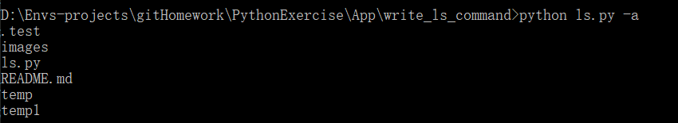

# python 实现ls命令

熟悉Linux的同学都知道，ls命令基本上是我们常用的命令之一，但是在windows下，很遗憾没有ls命令，只有一个类似的命令，叫dir。当时我就不乐意了，为什么不能将dir命令改成ls命令，所以我就马上写了一个ls命令的脚本，在这里分享给大家。


### 演示环境
* 操作系统：windows10
* python版本：python 3.7
* idea：pycharm 2018.2 
* 使用模块：argparse, os


### 了解argparse模块

argparse是python的标准库，他可以使我们很友好的编写命令行界面，并且可以自动生成帮助文档和使用消息，还能在参数无效的时候发出错误。


##### 1. argparse.ArgumentParse类参数理解

1. prog：改变应用的名字，我们可以使用`%(prog)s`引用应用的名字，默认的应用名字为文件名。

2. usage: 显示这个命令用法, 一般用来显示参数的用法

3. description：显示这个命令的帮助信息

4. epilog: 显示命令的帮助信息，位置在参数的下面


##### 2. argparse.ArgumentParser.add_argument函数理解

1. name | flags: 指定参数的名字

2. action: 指定命令行参数，内置为以下几种

    - store: 默认值，仅仅保存参数值。
    - store_const: 与store基本一致，但是只保存const关键字指定的值，其它的值会报错
    - store_true | store_false: 与store_const基本一致，只保存True和False
    - append: 将相同参数的不同值保存在一个list中
    - count: 统计参数出现的次数
    - help: 输出程序的帮助信息
    - version: 输出程序版本信息

3. nargs: 将不同数量的值与一个参数关联起来

    - nargs=N:N为整数
    - nargs='?'
    - nargs='*': 将所有的参数保存在列表中
    - nargs='+': 将所有的参数保存在列表中，但是至少得有一个参数
    - nargs=argparse.REMAINDER: 其余的参数全部保存在一个list中

4. default: 如果没有传入这个参数，默认使用default参数的值

5. type: 接收到的参数会经过这个参数对应的函数处理。

6. choices: 将参数指定在一个范围内，超出就报错

7. required: 指定参数是否为必传参数。

8. dest: 自定义参数的名称，默认名称为 **“- 后面的值”** 或者 **“-- 后面的值”**。


### 编写ls命令脚本

这里我们就简单的指定三个参数.
- -a: 添加 -a 参数，显示隐藏文件。
- -r: 添加 -r 参数，递归显示文件夹下面的文件。
- -d: 指定显示目录，如果不指定，默认为当前目录。

首先我们使用 ArgumentParser 类来指定参数。
```python
import os
import argparse

parser = argparse.ArgumentParser(prog='ls', description='显示文件夹下的文件')

# 指定参数
parser.add_argument('-a', '--all', const=True, nargs='?', help='是否显示隐藏文件')
parser.add_argument('-d', '--directory', help='指定显示的目录，如果不指定，默认为当前目录')
parser.add_argument('-r', '--recursion', const=True, nargs='?', help='是否递归显示')

# 解析参数
args = parser.parse_args()

# 拿到directory参数，如果没有传这个参数，为None
directory = args.directory
# 如果directory有值
if directory:
    # 如果指定目录不存在，抛出异常
    if not os.path.exists(directory):
        raise ValueError(f'{directory} does`t exist')

    # 如果directory不是一个目录，抛出异常
    if not os.path.isdir(directory):
        raise ValueError(f'{directory} is not a directory')

# 如果directory为None，给directory赋值
else:
    directory = '.'
```

我们规定好参数之后，接下来就是具体ls的实现。我们封装一个LsCommand类

```python
class LsCommand():
    def __init__(self, show_all=False, directory='.', recursion=False):
        '''
        :param show_all: 是否显示隐藏文件
        :param directory: 指定的文件目录
        :param recursion: 是否递归显示目录下的文件
        '''
        self.show_all = show_all
        self.recursion = recursion
        self.directory = os.path.abspath(directory)

    def handle_dir(self, directory, grade=1, placeholder='--'):
        '''
        处理目录
        :param directory: 文件目录
        :param grade: 目录层级
        :param placeholder: 子目录文件前面的占位符
        :return:
        '''

        # 判断是否为文件夹

        # grade是否增加过了

        # os.listdir: 列出当前文件夹下面的所有文件和文件夹
        # 遍历目录下的文件，文件夹
        pass

    def show_file_or_dir(self, file, prefix=''):

        # 如果不显示隐藏文件

        # 打印前缀和文件名
        pass

    def run(self):
        '''
        运行ls命令
        :return:
        '''

        # os.listdir(dir) 得到dir目录下所有文件，文件夹
        # 遍历self.directory目录先所有文件，文件夹
        pass
```

ls这个类我们也封装好了，接下来我们将得到的参数传入LsCommand类中，然后运行，就可以愉快的得出结果。

```python
ls = LsCommand(bool(args.all), directory, bool(args.recursion))
ls.run()
```

效果展示：
* python ls.py


* python ls.py -a


* python ls.py -a -r


* python ls.py -d ./temp
