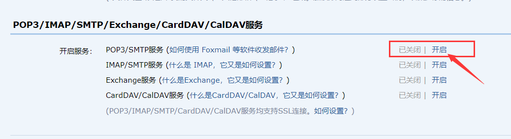
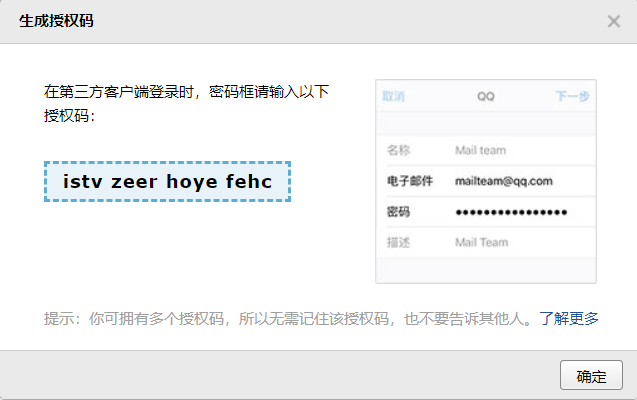
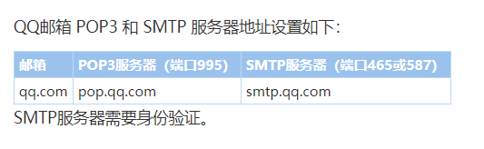
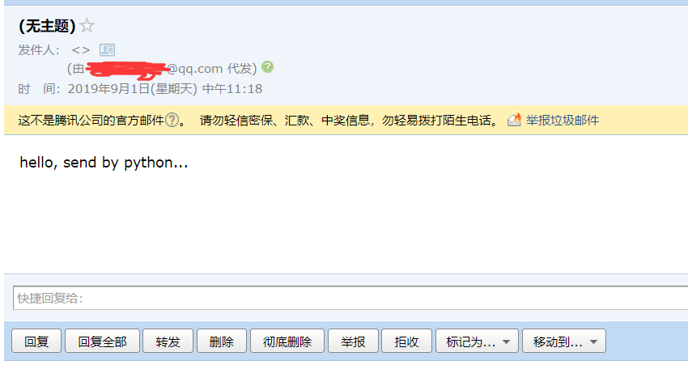
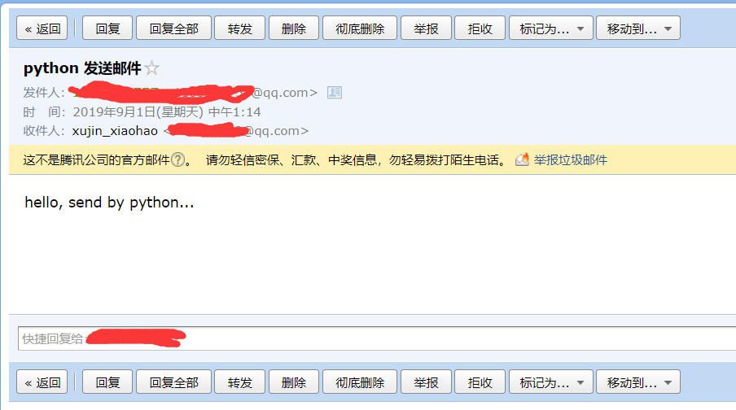
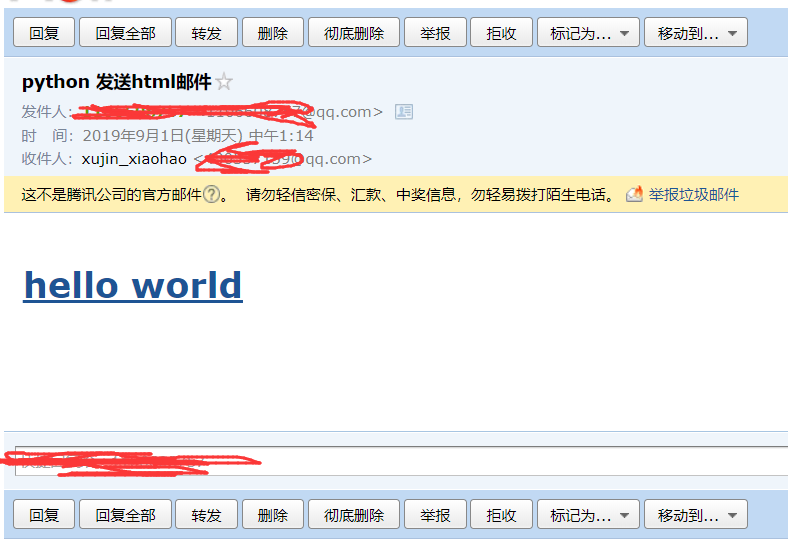
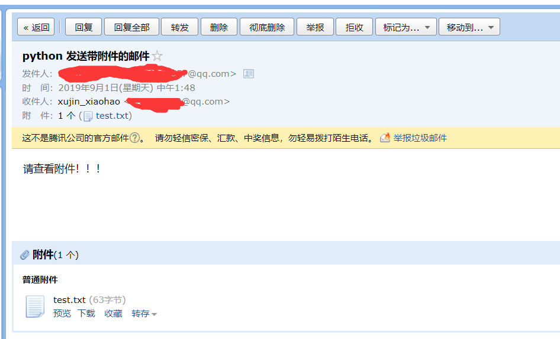
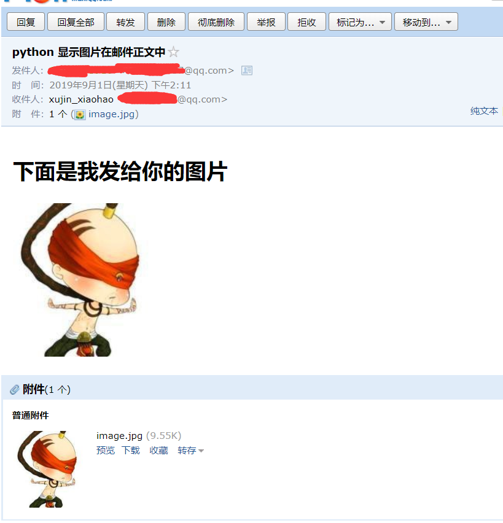
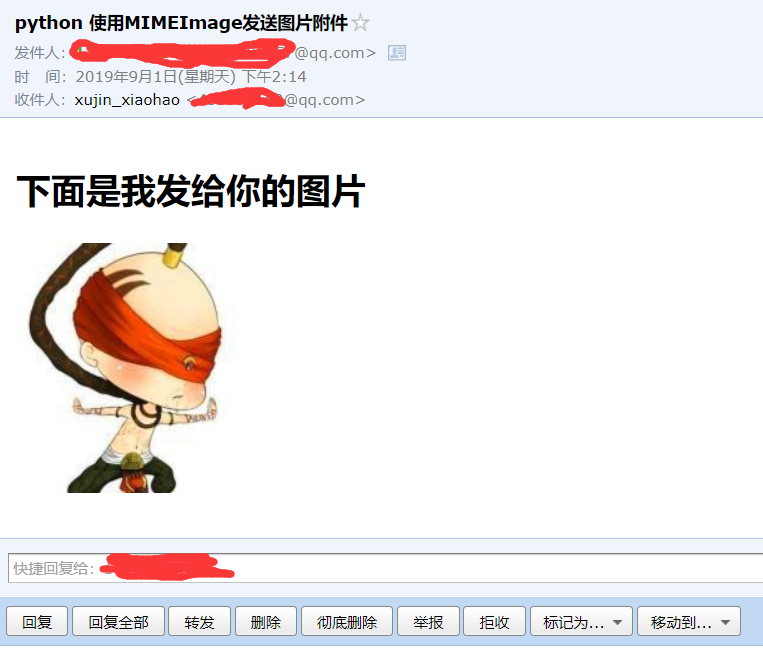

# python 发送邮件

在一个web项目中，邮件也经常扮演者重要的角色，那么使用代码发送邮件也成为了我们必须得会的一个技能。下面我们就来看一下如何使用python发送邮件。

### 演示环境
* 操作系统：windows10
* python版本：python 3.7
* 代码编辑器：pycharm 2018.2
* 使用模块：email, smtplib
* tips: 这些模块不用我们安装，是python自带的模块

**注意：** 以下所有例子都是在QQ邮箱上实现的。

### 准备工作
首先我们先去QQ邮箱得到授权码，在qq邮箱的 设置->账户 中找到下图位置。



点击开启，然后按照操作提示进行下去，我们就会得到一个授权码。



然后我们需要知道QQ邮箱的服务器地址，下图是qq邮件服务器信息



POP3服务器是接收邮件的服务器地址，SMTP服务器是发送邮件的服务器地址，我们需要使用的就是SMTP服务器地址，也就是`smtp.qq.com`

### 发送一封简单的邮件（纯文本邮件）

首先我们构建一个消息对象，里面存放我们需要发送的信息。

```python
from email.mime.text import MIMEText

msg = MIMEText('hello, send by python...', 'plain', 'utf-8')
```

MIMEText参数说明：
* _text: 发送的文本
* _subtype: 发送的邮件类型，默认就是`plain`，最终的MIME就是`text/plain`
* _charset: 制定编码格式，默认是`us-ascii`

需要发送的消息对象构造好了，接下来我们就可以发送我们的邮件了。
```python
from email.mime.text import MIMEText
import smtplib

# 发送邮箱的账号
account = '<发件人的QQ>@qq.com'
# 授权码，修改为发件人的授权码
auth_code = 'istvzeerhoyefehc'

# 接收人的邮箱
msg_to = '<接收人的QQ>@qq.com'

def simple_email():
    # 消息对象
    msg = MIMEText('hello, send by python...', 'plain', 'utf-8')
    
    # 首先创建一个SMTP对象，后面所有的操作都是基于这个对象
    server = smtplib.SMTP('smtp.qq.com', 25)
    # 登录邮箱
    server.login(account,auth_code)
    # 发送邮件
    server.sendmail(account,[msg_to],msg.as_string())
    # 关闭连接
    server.quit()
```

* smtplib.SMTP:
    * host: 邮箱服务器地址
    * port: 邮箱服务器端口，smtp的默认端口就是25，所以我们这里写25就可以了。
* smtplib.SMTP.login:
    * user: 发送人的邮箱账号
    * password: 发送人的邮箱授权码，注意，这里的password不是邮箱的密码，而是授权码。
* smtplib.SMTP.sendmail:
    * from_addr: 发送人邮箱账号
    * to_addrs: 接收人邮箱账号，因为可以十多个，这里使用一个列表来存放
    * msg: 发送的消息
    
上面，我们就发送看一封简单的邮件了，没有主题，没有附件，也不是富文本。



### 发送带主题的邮件
```python
from email.mime.text import MIMEText
import smtplib

# 发送邮箱的账号
account = '<发件人的QQ>@qq.com'
# 授权码，修改为发件人的授权码
auth_code = 'istvzeerhoyefehc'

# 接收人的邮箱
msg_to = '<接收人的QQ>@qq.com'

def has_subject_email():
    msg = MIMEText('hello, send by python...', 'plain', 'utf-8')
    # 主题
    msg['Subject'] = 'python 发送邮件'
    # 发件人
    msg['From'] = '发件人'
    # 收件人
    msg['To'] = '收件人'

    server = smtplib.SMTP('smtp.qq.com', 25)
    server.login(account, auth_code)
    server.sendmail(account, [msg_to], msg.as_string())
    server.quit()
```

我们可以看到，我们在msg中添加了几个属性，给邮件设置了主题，发件人，收件人等。（我们上面发送第一封简单的邮件的时候，是没有发件人的，只有代发送人，也没有接收人。）这也就说明邮件主题，发件人，收件人等信息并不是通过SMTP协议发出去的，而是包含在MIMEText的文本中，所以，我们必须把这些参数添加到MIMEText中，才是一封完整的邮件。



### 带html的邮件
```python
from email.mime.text import MIMEText
import smtplib

# 发送邮箱的账号
account = '<发件人的QQ>@qq.com'
# 授权码，修改为发件人的授权码
auth_code = 'istvzeerhoyefehc'

# 接收人的邮箱
msg_to = '<接收人的QQ>@qq.com'
def has_html_email():
    text = '''
    <html>
        <body>
            <h1>
                <a href="http://ww.baidu.com">hello world</a>
            </h1>
        </body>
    </html>
    '''
    msg = MIMEText(text, 'html', 'utf-8')
    # 主题
    msg['Subject'] = 'python 发送html邮件'
    # 发件人
    msg['From'] = account
    # 收件人
    msg['To'] = msg_to

    server = smtplib.SMTP('smtp.qq.com', 25)
    server.login(account, auth_code)
    server.sendmail(account, [msg_to], msg.as_string())
    server.quit()
```

想要发送带html文本的邮件，我们只需要将MIMEText的第二个参数改为`html`就可以了。



### 带附件的邮件

带附件的邮件我们可以看成包含若干部分的邮件，所以，我么可以构造一个MIMEMultipart对象代表邮件本省，然后往里面添加MIMEText作为邮件正文，再继续往里面添加表示附件的对象就可以了。

```python
from email.mime.text import MIMEText
from email.mime.multipart import MIMEMultipart
import smtplib

# 发送邮箱的账号
account = '<发件人的QQ>@qq.com'
# 授权码，修改为发件人的授权码
auth_code = 'istvzeerhoyefehc'

# 接收人的邮箱
msg_to = '<接收人的QQ>@qq.com'

def has_attachment_email():
    # 构造邮件对象
    msg = MIMEMultipart()

    msg['From'] = account
    msg['To'] = msg_to
    msg['Subject'] = 'python 发送带附件的邮件'

    # 构造邮件正文
    text = MIMEText('请查看附件！！！', 'plain', 'utf-8')

    # 构造附件
    with open('attachments/test.txt', 'rb') as fp:
        file = MIMEText(fp.read(), 'base64', 'utf-8')

        # 将附件重命名
        file.add_header('Content-Disposition','attachment',filename='test.txt')

    # 添加附件到邮件中
    msg.attach(file)
    # 添加邮件正文到邮件中
    msg.attach(text)

    server = smtplib.SMTP('smtp.qq.com', 25)
    server.login(account, auth_code)
    server.sendmail(account, [msg_to], msg.as_string())
    server.quit()
```



### 将附件显示在邮件正文中

上面我们使用邮件发送了一个txt文件，如果我们换成图片文件，也是可以的。那么我们如果想让这张图片显示在邮件正文中，我们应该怎样写呢？直接写图片的url地址可以吗？答案当然是不可以的，因为我们不知道url地址是否安全，所以我们不能这样显示，得换另外一种方法。设置附件的id。

```python
from email.mime.text import MIMEText
from email.mime.multipart import MIMEMultipart
import smtplib

# 发送邮箱的账号
account = '<发件人的QQ>@qq.com'
# 授权码，修改为发件人的授权码
auth_code = 'istvzeerhoyefehc'

# 接收人的邮箱
msg_to = '<接收人的QQ>@qq.com'

def show_image_in_text():
    msg = MIMEMultipart()

    msg['From'] = account
    msg['To'] = msg_to
    msg['Subject'] = 'python 显示图片在邮件正文中'

    # 构造邮件正文
    html_text = '''
    <html>
        <body>
            <h1>
                下面是我发给你的图片
            </h1>
            <!-- cid后面就是设置的附件的id -->
            <p></p>
        </body>
    </html>
    '''
    text = MIMEText(html_text, 'html', 'utf-8')

    # 构造附件
    with open('attachments/image.jpg', 'rb') as fp:
        file = MIMEText(fp.read(), 'base64', 'utf-8')

        # 将附件重命名
        file.add_header('Content-Disposition', 'attachment', filename='image.jpg')
        # 设置附件id
        file.add_header('Content-ID','<0>')

    # 添加附件到邮件中
    msg.attach(file)

    # 添加邮件正文到邮件中
    msg.attach(text)

    server = smtplib.SMTP('smtp.qq.com', 25)
    server.login(account, auth_code)
    server.sendmail(account, [msg_to], msg.as_string())
    server.quit()
```


### 使用MIMEImage类发送图片附件

我们也可以使用MIMEImage类来发送图片。

```python
from email.mime.text import MIMEText
from email.mime.multipart import MIMEMultipart
from email.mime.image import MIMEImage
import smtplib

# 发送邮箱的账号
account = '<发件人的QQ>@qq.com'
# 授权码，修改为发件人的授权码
auth_code = 'istvzeerhoyefehc'

# 接收人的邮箱
msg_to = '<接收人的QQ>@qq.com'

def use_MIMEImage_send_image():
    msg = MIMEMultipart()

    msg['From'] = account
    msg['To'] = msg_to
    msg['Subject'] = 'python 使用MIMEImage发送图片附件'

    # 构造邮件正文
    html_text = '''
        <html>
            <body>
                <h1>
                    下面是我发给你的图片
                </h1>
                <p></p>
            </body>
        </html>
        '''
    text = MIMEText(html_text, 'html', 'utf-8')

    # 构造附件
    with open('attachments/image.jpg', 'rb') as fp:
        image = MIMEImage(fp.read())

        image['Content-Type'] = 'application/octet-stream'

        # 将附件重命名
        image.add_header('Content-Disposition', 'attachment', filename='image.jpg')
        # 设置附件id
        image.add_header('Content-ID', '<image1>')

    # 添加附件到邮件中
    msg.attach(image)

    # 添加邮件正文到邮件中
    msg.attach(text)

    server = smtplib.SMTP('smtp.qq.com', 25)
    server.login(account, auth_code)
    server.sendmail(account, [msg_to], msg.as_string())
    server.quit()
```

