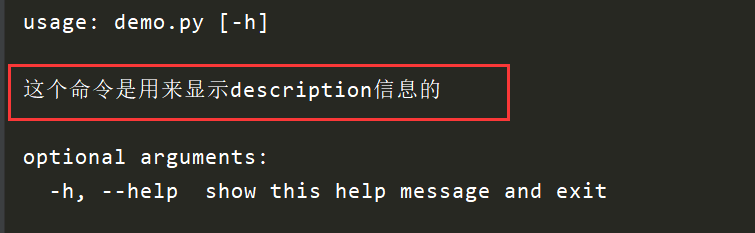
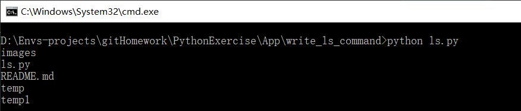
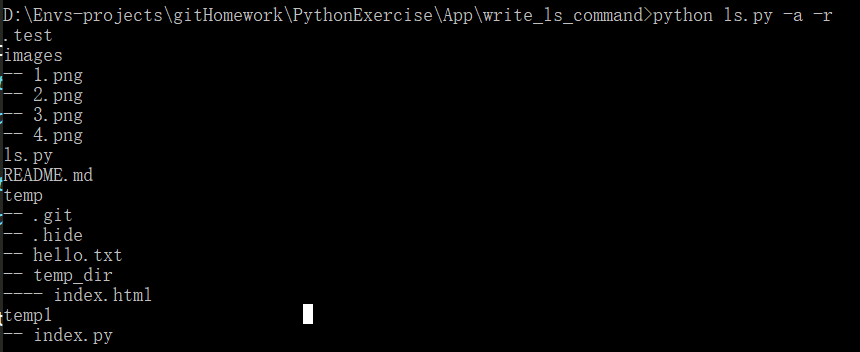
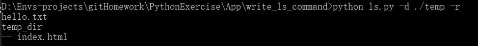

# python 实现ls命令

熟悉Linux的同学都知道，ls命令基本上是我们常用的命令之一，但是在windows下，很遗憾没有ls命令，只有一个类似的命令，叫dir。当时我就不乐意了，为什么不能将dir命令改成ls命令，所以我就马上写了一个ls命令的脚本，在这里分享给大家。

### 演示环境
* 操作系统：windows10
* python版本：python 3.7
* idea：pycharm 2018.2 
* 使用模块：argparse, os

### 了解argparse模块

argparse是python的标准库，他可以使我们很友好的编写命令行界面，并且可以自动生成帮助文档和使用消息，还能在参数无效的时候发出错误。

##### 1. argparse.ArgumentParse类参数理解
1. prog：改变应用的名字，我们可以使用`%(prog)s`引用应用的名字，默认的应用名字为文件名。
```python
import argparse

def prog_demo():
    parser = argparse.ArgumentParser(prog='my_progress')
    
    # help参数中我们就引用了prog参数的值
    parser.add_argument('--foo', help='foo of the %(prog)s program')
    
    # parser.parse_args解析参数，需要传入一个数组
    parser.parse_args('-h'.split())
```


2. usage: 显示这个命令用法, 一般用来显示参数的用法
```python
def usage_demo():
    # usage: 改变usage 显示信息
    parser = argparse.ArgumentParser(prog='usage_demo', usage='%(prog)s [options] demo')
    parser.add_argument('--foo', nargs='?', help='foo help')
    parser.parse_args('-h'.split())
```


3. description：显示这个命令的帮助信息
```python
def description_demo():
    # description:
    parser = argparse.ArgumentParser(description='这个命令是用来显示description信息的')
    parser.parse_args('-h'.split())
```


4. epilog: 显示命令的帮助信息，位置在参数的下面
```python
def epilog_demo():
    parser = argparse.ArgumentParser(description='这个命令是用来显示description信息的', epilog='显示在参数之后的描述信息')
    parser.parse_args('-h'.split())
```


##### 2. argparse.ArgumentParser.add_argument函数理解
1. name | flags: 指定参数的名字:
```python
def name_demo():
    parser = argparse.ArgumentParser()
    # 可选参数-a | --age
    parser.add_argument('-a', '--age')
    # 位置参数 name
    parser.add_argument('name')
    result = parser.parse_args(['xxx'])
    print(result)
    result = parser.parse_args(['-a', '18', 'xxx'])
    print(result)
    result = parser.parse_args(['--age', '20', 'xxx'])
    print(result)
   
###########
# 运行结果 #
###########
Namespace(age=None, name='xxx')
Namespace(age='18', name='xxx')
Namespace(age='20', name='xxx')
```

2. action: 指定命令行参数，内置为以下几种

* store: 默认值，仅仅保存参数值。
```python
def action_demo():
    # 指定命令行参数，内置的有下面几种
    parser = argparse.ArgumentParser()

    # * store: 默认值，仅仅保存参数值，不做处理
    parser.add_argument('-f', action='store')
    result = parser.parse_args('-f 1'.split())
    print(result)

###########
# 运行结果 #
###########
Namespace(f='1')
```
* store_const: 与store基本一致，但是只保存const关键字指定的值，其它的值会报错
```python
def acton_demo():
    parser = argparse.ArgumentParser()
    
    parser.add_argument('-f', action='store_const', const=18)
    result = parser.parse_args('-f'.split())
    print(result)
    # 报错，const指定的是18整数，-f 18得到的是字符窜
    result = parser.parse_args('-f 18'.split())
    print(result)
  
###########
# 运行结果 #
###########  
Namespace(f=18)
usage: demo.py [-h] [-f]
demo.py: error: unrecognized arguments: 18
```

* store_true | store_false: 与store_const基本一致，只保存True和False
```python
def acton_demo():
    parser = argparse.ArgumentParser()
    
    parser.add_argument('-f', action='store_true')
    parser.add_argument('-b', action='store_false')
    result = parser.parse_args('-f -b'.split())
    print(result)

###########
# 运行结果 #
########### 
Namespace(b=False, f=True)
```

* append: 将相同参数的不同值保存在一个list中
```python
def acton_demo():
    parser = argparse.ArgumentParser()
    
    parser.add_argument('-f', action='append')
    result = parser.parse_args('-f 1 -f 2 -f 3'.split())
    print(result)

###########
# 运行结果 #
########### 
Namespace(f=['1', '2', '3'])
```

* count: 统计参数出现的次数
```python
def acton_demo():
    parser = argparse.ArgumentParser()
    
    parser.add_argument('-verbose', '-v', action='count')
    # 下面两句效果相同
    result = parser.parse_args('-v -v -v'.split())
    result = parser.parse_args('-vvv'.split())
    print(result)

###########
# 运行结果 #
########### 
Namespace(verbose=3)
```

* help: 输出程序的帮助信息
```python
def acton_demo():
    parser = argparse.ArgumentParser()
    
    parser.add_argument('-f', action='help')
    result = parser.parse_args('-f'.split())
    print(result)

###########
# 运行结果 #
########### 
usage: demo.py [-h] [-f]

optional arguments:
  -h, --help  show this help message and exit
  -f
```

* version: 输出程序版本信息
```python
def acton_demo():
    parser = argparse.ArgumentParser(prog='version_demo')
    
    parser.add_argument('-v', action='version', version='%(prog)s 2.0')
    result = parser.parse_args('-v'.split())
    print(result)

###########
# 运行结果 #
########### 
version_demo 2.0
```

3. nargs: 将不同数量的值与一个参数关联起来

* nargs=N:N为整数:
```python
def nargs_demo():
    parser = argparse.ArgumentParser()
    
    # 指定两个值与f参数关联起来
    parser.add_argument('-f', nargs=2)
    # 指定一个值与name参数关联起来
    parser.add_argument('name', nargs=1)
    result = parser.parse_args('-f a b xxx'.split())
    print(result)

###########
# 运行结果 #
########### 
Namespace(f=['a', 'b'], name=['xxx'])
```

* nargs='?':
    - 如果给出了参数值，那么就为给出的值，
    - 如果没有给出参数值，就会使用const关键字的值，
    - 如果不存在这个参数， 将生成默认值
```python
def nargs_demo():
    parser = argparse.ArgumentParser()
    
    parser.add_argument('-age', nargs='?', const='18', default='0')
    result = parser.parse_args('-age 20'.split())
    print(result)
    result = parser.parse_args('-age'.split())
    print(result)
    result = parser.parse_args()
    print(result)

###########
# 运行结果 #
########### 
Namespace(age='20')
Namespace(age='18')
Namespace(age='0')
```

* nargs='*': 将所有的参数保存在列表中
```python
def nargs_demo():
    parser = argparse.ArgumentParser()
    
    parser.add_argument('-f', nargs='*')
    parser.add_argument('-b', nargs='*')
    parser.add_argument('names', nargs='*')
    result = parser.parse_args('xx xxx -f a b -b a b c'.split())
    print(result)

###########
# 运行结果 #
########### 
Namespace(b=['a', 'b', 'c'], f=['a', 'b'], names=['xx', 'xxx'])
```

* nargs='+': 将所有的参数保存在列表中，但是至少得有一个参数
```python
def nargs_demo():
    parser = argparse.ArgumentParser()
    
    parser.add_argument('-f', nargs='+')
    parser.add_argument('-b', nargs='+')
    parser.add_argument('names', nargs='+')
    result = parser.parse_args('xx xxx -f a b -b a b c'.split())
    print(result)

###########
# 运行结果 #
########### 
Namespace(b=['a', 'b', 'c'], f=['a', 'b'], names=['xx', 'xxx'])
```

* nargs=argparse.REMAINDER: 其余的参数全部保存在一个list中
```python
def nargs_demo():
    parser = argparse.ArgumentParser()
    
    parser.add_argument('-f')
    parser.add_argument('-b')
    parser.add_argument('args', nargs=argparse.REMAINDER)
    result = parser.parse_args('-f a -b a b -names xxx xxxx'.split())
    print(result)

###########
# 运行结果 #
########### 
Namespace(args=['b', '-names', 'xxx', 'xxxx'], b='a', f='a')
```

4. default: 如果没有传入这个参数，默认使用default参数的值
```python
def default_demo():
    parser = argparse.ArgumentParser()
    parser.add_argument('-age', default=18)
    result = parser.parse_args()
    print(result)
    result = parser.parse_args('-age 10'.split())
    print(result)
    
###########
# 运行结果 #
###########
Namespace(age=18)
Namespace(age='10')
```

5. type: 接收到的参数会经过这个参数对应的函数处理。
```python
def type_func(value):
    print("type func " + value)
    return value

def type_demo():
    # type 接收到的参数会经过这个函数的处理， 再返回
    parser = argparse.ArgumentParser()
    parser.add_argument('f', type=int)
    parser.add_argument('file', type=type_func)
    result = parser.parse_args('18 temp.txt'.split())
    print(result)
    
###########
# 运行结果 #
###########
type func temp.txt
Namespace(f=18, file='temp.txt')
```

6. choices: 将参数指定在一个范围内，超出就报错
```python
def choices_demo():
    parser = argparse.ArgumentParser()
    parser.add_argument('move', choices=['left', 'middle', 'right'])
    result = parser.parse_args('left'.split())
    print(result)
    
###########
# 运行结果 #
###########
Namespace(move='left')
```

7. required: 指定参数是否为必传参数。
```python
def required_demo():
    # 指定命令行参数是否必须，默认通过-f --foo指定的额参数为可选参数, 及可以为空
    parser = argparse.ArgumentParser()
    parser.add_argument('--foo', required=True)
    result = parser.parse_args('--foo f'.split())
    print(result)
    
###########
# 运行结果 #
###########
Namespace(foo='f')
```

8. dest: 自定义参数的名称，默认名称为 **“- 后面的值”** 或者 **“-- 后面的值”**。
```python
def dest_demo():
    parser = argparse.ArgumentParser()
    parser.add_argument('-n', '--name', '--na')
    parser.add_argument('-a', dest='age')
    parser.add_argument('--gender', '-g')

    result = parser.parse_args('-n xxx -a 18 -g 男'.split())
    print(result)
    result = parser.parse_args('--na xxx -a 18 -g 男'.split())
    print(result)
    result = parser.parse_args('--name xxx -a 18 -g 男'.split())
    print(result)
    
###########
# 运行结果 #
###########
Namespace(age='18', gender='男', name='xxx')
Namespace(age='18', gender='男', name='xxx')
Namespace(age='18', gender='男', name='xxx')
```

### 编写ls命令脚本

这里我们就简单的指定三个参数.
* -a: 添加 -a 参数，显示隐藏文件。
* -r: 添加 -r 参数，递归显示文件夹下面的文件。
* -d: 指定显示目录，如果不指定，默认为当前目录。

首先我们使用ArgumentParser类来指定参数。
```python
import os
import argparse

parser = argparse.ArgumentParser(prog='ls', description='显示文件夹下的文件')

# 指定参数
parser.add_argument('-a', '--all', const=True, nargs='?', help='是否显示隐藏文件')
parser.add_argument('-d', '--directory', help='指定显示的目录，如果不指定，默认为当前目录')
parser.add_argument('-r', '--recursion', const=True, nargs='?', help='是否递归显示')

# 解析参数
args = parser.parse_args()

# 拿到directory参数，如果没有传这个参数，为None
directory = args.directory
# 如果directory有值
if directory:
    # 如果指定目录不存在，抛出异常
    if not os.path.exists(directory):
        raise ValueError(f'{directory} does`t exist')

    # 如果directory不是一个目录，抛出异常
    if not os.path.isdir(directory):
        raise ValueError(f'{directory} is not a directory')

# 如果directory为None，给directory赋值
else:
    directory = '.'
```

我们规定好参数之后，接下来就是具体ls的实现。我们封装一个LsCommand类

```python
class LsCommand():
    def __init__(self, show_all=False, directory='.', recursion=False):
        '''
        :param show_all: 是否显示隐藏文件
        :param directory: 指定的文件目录
        :param recursion: 是否递归显示目录下的文件
        '''
        self.show_all = show_all
        self.recursion = recursion
        self.directory = os.path.abspath(directory)

    def handle_dir(self, directory, grade=1, placeholder='--'):
        '''
        处理目录
        :param directory: 文件目录
        :param grade: 目录层级
        :param placeholder: 子目录文件前面的占位符
        :return:
        '''

        # 判断是否为文件夹
        if not os.path.isdir(directory):
            raise ValueError(f'{directory} is not a directory ')

        # grade是否增加过了
        grade_is_add = False

        # os.listdir: 列出当前文件夹下面的所有文件和文件夹
        # 遍历目录下的文件，文件夹
        for file in os.listdir(directory):
            # 构造绝对路径
            abs_path = os.path.join(directory, file)
            # 子目录，子文件打印的前缀
            prefix = grade * placeholder + ' '
            # 显示文件名
            self.show_file_or_dir(abs_path, prefix)

            # 如果是目录
            if os.path.isdir(abs_path):
                # 如果层级还没有增加，就增加一
                if not grade_is_add:
                    grade += 1

                # 继续进入处理目录的函数
                self.handle_dir(abs_path, grade=grade)

    def show_file_or_dir(self, file, prefix=''):

        # 如果不显示隐藏文件
        if not self.show_all:
            # os.path.basename(file) 只得到文件名,
            # 如果文件名是以'.'开始的，就直接返回，不打印
            if os.path.basename(file).startswith('.'):
                return

        # 打印前缀和文件名
        print(prefix + os.path.basename(file))

    def run(self):
        '''
        运行ls命令
        :return:
        '''

        # os.listdir(dir) 得到dir目录下所有文件，文件夹
        # 遍历self.directory目录先所有文件，文件夹
        for file in os.listdir(self.directory):
            # 构造绝对路径
            abs_path = os.path.join(self.directory, file)
            # 显示文件信息
            self.show_file_or_dir(abs_path)

            # 如果递归显示
            if self.recursion:
                # 如果是文件夹
                if os.path.isdir(abs_path):
                    # 进入处理文件夹的函数
                    self.handle_dir(abs_path)
```

ls这个类我们也封装好了，接下来我们将得到的参数传入LsCommand类中，然后运行，就可以愉快的得出结果。
```python
ls = LsCommand(bool(args.all), directory, bool(args.recursion))
ls.run()
```

效果展示：
* python ls.py


* python ls.py -a


* python ls.py -a -r


* python ls.py -d ./temp
